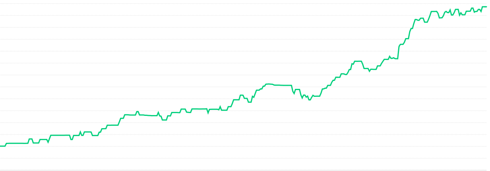

# Intro

L'heure de ma rétro a sonné ! 2025, une super année. De beaux moments de famille, encore de belles constructions à la maison. Et surtout un petit deuxième en préparation.

## Waykonect

Toujours dans cette entreprise, quoi ?! Presque 4 ans sans changer d’entreprise ? Incroyable !

Eh bien peut-être simplement car c'est la première entreprise qui me permet d'évoluer dans ma carrière. 

J'avais à l'époque accepté de retourner "dev junior" pour enfin faire du dev iOS, je suis passé par dev confirmé, lead dev, et je suis en route pour être Staff Engineer.

En fait, c'est bête mais savoir que l'on peut avancer donne l'envie de se lever chaque matin. Ce n'est pas forcément facile tous les jours, mais ce n'est tout simplement pas en vain.

Cette année avec l'équipe on a passé une bonne journée durant la WWDC pour se faire des ateliersd et aussi participé à la Swift Connection.

C'était quand même une année éprouvante, beaucoup de challenges, de deadlines claquées. Mais heureusement il y a eu aussi de belles rencontres qui donnent la peine de se lever le matin.

## District-web

Mon auto-entreprise et surtout nouveauté : mon entreprise ! 

J'ai enfin décidé de créer mon entreprise, le grand saut malgré ma phobie administrative...

Le but étant d'avoir une fiscalité plus avantageuse que l'auto-entreprise et surtout d'avoir une image plus sérieuse pour faire avancer mes projets.

## Retour sur les objectifs de 2024

La rentabilité de mes apps était un objectif et il est réussi !

Réduction du coût de mes serveurs, augmentation du nombre d'abonnements dans mes apps.

Bref pas de l'argent pour de l'argent mais bien produire un service avec un retour sur investissement.

Je n'ai pas encore vraiment réussi à couper des apps. Mais cela va faire partie des objectifs de 2026.

## Mes Apps (Stats 1 Janv - 5 Dec)

### Baby-link

Encore une fois babylink est là. Mais elle ne prend pas, j'ai eu quelques utilisateurs mais ils ne restent pas... 

J'avais eu une piste d'un partenariat avec une crèche mais j'ai loupé le coche.

À chaque fois que j'en parle autour de moi, les mêmes réactions : Trop bien !

Voilà trop d'années maintenant que je vous parle du projet baby-link, c'est un projet de cœur, et c'est peut-être finalement les pires à gérer ?

Initialement bloqué au marché français, je travaille en ce moment à l'ouvrir au global.

### Reef Buddy

Mon application pour suivre l’aquarium marin, j'ai beaucoup travaillé dessus cette année.
Travaux sur l'ASO, migration du backend, intégration d'abonnement pour aider les utilisateurs à comprendre leurs mesures.
Je suis très content de la progression, mais j'ai encore beaucoup de travail sur le taux de conversion.

|                   |       |
|-------------------|-------|
| 94.1k impressions | +55%  |
| 1.41k downloads   | +109% |
| 9k sessions       | +143% |

Bon départ de revenus, hâte de voir la progression

### Mazout’

Mazout est une application pour trouver et acheter son carburant moins cher, j'ai enfin obtenu l'agrément CarPlay, mais je n'ai pas encore passé de temps dessus, j'ai donc laissé en attente pour le moment

Le prix de 2 € le litre étant un lointain souvenir... c'est dur dur.

|                    |      |
|--------------------|------|
| 55.8k impressions  | -12% |
| 897 downloads      | 0%   |
| 7.89k sessions     | +12% |

### Barista

Mon app pour suivre sa consommation de caféine. Je n'y ai pas vraiment touché cette année... Et les chiffres parlent d'eux-mêmes.

|                   |       |
|-------------------|-------|
| 40.8k impressions | +7%   |
| 441 downloads     | -13%  |
| 4.27k sessions    | -2%   |
| Revenus           | -14%  |

### Deviner le mot

Sûrement l’application la plus simple du monde : faire deviner le mot !

C’est une vieille application que j’ai faite un peu évoluer cette année en corrigeant des bugs et en ajoutant de nouveaux mots. 
Même chose que l'année dernière au final.

|           |               |
|-----------|---------------|
| 50.9k impressions | -9%  |
| 3.27k downloads   | -15% |
| 5.31k sessions    | -3%  |
| Revenus           | +22% |

J'ai hâte de voir Noël et fin d'année s'il y a toujours le même pic d'achat.

### Stop SMS

Elle permet de détecter les SPAM SMS. 

SHERLOCKED BY Apple

Elle sera supprimée des stores.

### LOA Tracker

Application lancée en 2023, cette application permet de saisir et de suivre le kilométrage d’une location LOA.
Je suis toujours content de l'avoir et la trouve toujours aussi utile, je dois trouver un moyen de la promouvoir, d'augmenter le taux de conversion.

|                   |        |
|-------------------|--------|
| 6.88k impressions | +81%   |
| 6 downloads       | +200%  |
| 106 sessions      | +33%   |
| Revenus           | +700%  |

### Opinion

Lancée l'année dernière, le but est simple : suivre les notes et reviews de l’App Store et assister l’utilisateur grâce à l'IA dans l’écriture des réponses.
Elle ne prend pas du tout, elle m'est vraiment utile, mais sera sûrement supprimée des stores.

|                   |       |
|-------------------|-------|
| 4.93k impressions | -13%  |
| 27 downloads      | -43%  |
| 29 sessions       | -57%  |

### Wallabag

Wallabag est un projet open source permettant de sauvegarder des pages web pour les lire plus tard et les conserver.
Je ne publie plus l'app iOS en open source, mais je continue de suivre le repository afin de répondre aux utilisateurs.

|                    |        |
|--------------------|--------|
| 106k impressions   | +102%  |
| 7.92k downloads    | +81%   |
| 27.9 sessions      | +86%   |
| Revenus            | +363%  |

## Bilan et Objectif 2026

Une bonne progression sur les revenus de mes apps, avec le vide coding je me rends compte qu'il devient très facile de "coder", il devient important pour moi de marketer mes apps.

Inspiré par plein d'indie dev, je reve de leur place et j'ai pour objectif clair d'augmenter mon ARR.

Ce sera donc l'objectif de l'année 2026

Bonne fin d'année
